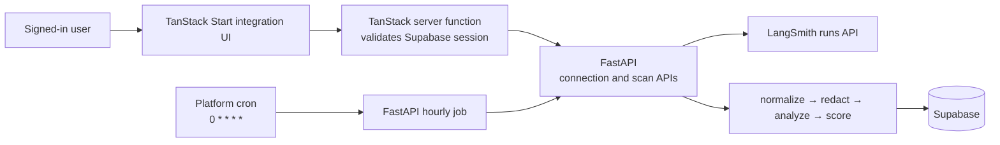

# LangSmith user integration

## Goal

Authenticated Flint user connects a LangSmith workspace/project. Flint pulls that
project's newest completed traces every hour, redacts them, scans them through the
existing FastAPI pipeline, and shows resulting cards in that user's scans.

One LangSmith trace produces one Flint roast. Child LangSmith runs become spans in
that roast.

## Non-goals

- No public LangSmith OAuth button. LangSmith Cloud API integration uses a
  user-created API key, not a third-party OAuth consent flow.
- No browser storage of LangSmith keys.
- No direct browser-to-LangSmith or browser-to-Supabase access for connection data.
- No full historical import. First sync looks back 24 hours, caps at 50 traces.
- No per-user scan-frequency control. All active connections run every hour.

## User flow

1. User opens **App → Integrations**.
2. User selects **Connect LangSmith**.
3. User supplies a connection label, LangSmith API endpoint, API key, workspace,
   and project.
4. Backend validates the key, lists available workspaces/projects, then stores
   versioned encrypted ciphertext only.
5. UI shows connection state, selected project, last success, last scan count,
   and safe error text.
6. Hourly job scans new traces. User may choose **Scan now**.
7. User may pause, reconnect, or disconnect. Disconnect removes ciphertext and
   keeps existing redacted cards.

Connection copy tells users to create a workspace-scoped LangSmith service key
when possible. A PAT is allowed only when their LangSmith role cannot make a
service key.

## Architecture



The browser never receives a LangSmith credential. Existing frontend auth proves
the Flint user to TanStack Start. TanStack Start calls FastAPI with an internal
service token and the verified user ID. FastAPI trusts that user ID only when the
internal token is valid.

## Credential security

`api_key_encrypted` in `langsmith_connections` is ciphertext, not an encoded
plain API key. Before implementation, choose one approved server-side key source:

1. Cloud KMS / secrets manager envelope encryption, preferred for production.
2. Supabase Vault accessed only through a locked-down server RPC.
3. An approved Python encryption dependency with `LANGSMITH_CREDENTIAL_KEY` in
   `api/.env`, acceptable for this single-service MVP.

Do not use base64, a reversible home-grown cipher, Supabase publishable keys, or
frontend environment variables. The encryption key never goes in Supabase.

The existing dependency list has no supported encryption package. Ask before
adding one; the rest of this integration uses installed `httpx`.

## Data model

Run `api/schema.sql` in Supabase. It adds:

- `langsmith_connections`: one user-owned, encrypted connection per selected
  workspace/project.
- `roasts.langsmith_connection_id`: provenance link, nulled if connection is
  deleted.
- `roasts.external_trace_id`: LangSmith trace ID.
- unique `(langsmith_connection_id, external_trace_id)`: idempotent hourly pulls.
- `cursor_time` and `cursor_run_id`: durable incremental-sync checkpoint.
- `sync_locked_until`: per-connection lease used by manual and cron syncs.

`roasts` retains redacted trace data only. API keys never appear in `roasts`,
logs, errors, or API responses.

## Backend plan — Python / FastAPI

### Files

```text
api/app/config.py
api/app/models.py
api/app/db.py
api/app/pipeline.py
api/app/main.py
api/app/integrations/__init__.py
api/app/integrations/langsmith.py
api/app/security/credentials.py
api/app/routers/integrations.py
api/app/routers/jobs.py
api/tests/test_langsmith_adapter.py
api/tests/test_langsmith_connections.py
api/tests/test_langsmith_sync.py
```

`api/app/normalize/` and `api/app/analyze/` stay pure. Network calls and
credential operations stay under `integrations/` and `security/`.

### Settings

Add server-only settings:

```dotenv
INTERNAL_API_TOKEN=
CRON_SECRET=
LANGSMITH_CREDENTIAL_KEY=
LANGSMITH_SYNC_BATCH_SIZE=50
LANGSMITH_INITIAL_LOOKBACK_HOURS=24
LANGSMITH_SYNC_OVERLAP_SECONDS=120
LANGSMITH_SYNC_LEASE_SECONDS=900
```

- `INTERNAL_API_TOKEN`: TanStack server → FastAPI authentication.
- `CRON_SECRET`: scheduler → FastAPI authentication.
- `LANGSMITH_CREDENTIAL_KEY`: only if approved application encryption is chosen.
- Batch, lookback, overlap, and lease values have safe defaults in `config.py`.

Do not add any LangSmith or security value to root `.env` or frontend build env.

### API boundary

These FastAPI endpoints require the internal token. The TanStack server function
obtains `user_id` from the Supabase session and sends it as a trusted internal
header; it never accepts `user_id` from browser form data.

```text
POST   /integrations/langsmith
GET    /integrations/langsmith
PATCH  /integrations/langsmith/{connection_id}
POST   /integrations/langsmith/{connection_id}/sync
DELETE /integrations/langsmith/{connection_id}

POST   /internal/jobs/langsmith-hourly
```

Connection response shape, excluding all credentials:

```json
{
  "id": "uuid",
  "label": "Production support",
  "endpoint": "https://api.smith.langchain.com",
  "workspace_id": "uuid",
  "project_name": "support-agent",
  "status": "active",
  "last_sync_finished_at": "2026-07-18T10:00:00Z",
  "last_success_at": "2026-07-18T10:00:00Z",
  "last_scan_count": 6,
  "last_error": null
}
```

Validation and discovery happen in two API calls:

```text
POST /integrations/langsmith/validate-key
POST /integrations/langsmith/discover
```

Both receive the entered key in the request body, use it only for that request,
and return safe workspace/project metadata. Only the final create/update call
encrypts and persists it.

### LangSmith client

`integrations/langsmith.py` uses `httpx.Client` and sends:

```text
X-Api-Key: decrypted connection key
X-Tenant-Id: selected workspace ID
```

Use endpoint supplied by the connection. Support LangSmith regional endpoints;
only permit HTTPS endpoints.

Query rules:

1. Query only the selected project.
2. Query completed root runs after `cursor_time - overlap`.
3. First run uses `now - 24h`.
4. Bound each request to `LANGSMITH_SYNC_BATCH_SIZE` (50).
5. Request only fields needed for conversion and scanning.
6. Group child runs by `trace_id`.
7. Sort root traces oldest-first before scan.

Adapter mapping:

| LangSmith run field | Flint value |
| --- | --- |
| `trace_id` | `external_trace_id`; one roast |
| `id` | span ID |
| `parent_run_id` | `parent_id` |
| `run_type=llm` | `llm` span |
| `run_type=tool` | `tool` span |
| chain/retriever/other | `other` span |
| `inputs` | span input |
| `outputs` and `error` | span output |
| `start_time` / `end_time` | start/duration |
| available usage metadata | measured tokens |
| missing usage | existing estimated-token path |

The adapter emits a generic trace payload. It then calls the existing
`run_pipeline`; do not duplicate redaction, scoring, or roast logic.

### Sync state and idempotency

For each active connection:

1. Atomically acquire a `sync_locked_until` lease. If already leased, skip it.
2. Read/decrypt credential in memory only.
3. Fetch a bounded batch of completed root traces and their child runs.
4. For each trace, call the existing pipeline with:

```python
source="langsmith"
format="generic"
user_id=connection.user_id
langsmith_connection_id=connection.id
external_trace_id=trace_id
```

5. Insert only if `(connection_id, trace_id)` does not already exist.
6. On a fully processed page, move cursor to latest root run time/ID.
7. Save safe result metadata, release lease.

The two-minute overlap covers traces that arrive late. The unique index makes the
overlap harmless. Advance the cursor only after every trace on that page has a
terminal result.

### Errors

- Invalid or revoked key: mark connection `invalid`, remove/deactivate credential
  after user confirmation, show reconnect state.
- `429` / timeout / 5xx: keep cursor unchanged, store a safe error code, retry
  next hour.
- Malformed one trace: record failure, continue remaining traces; do not log raw
  payload.
- Pipeline failure: store the trace failure in safe job metadata and retry from
  overlap window.
- Unexpected error: release lease in `finally`.

Never include LangSmith response bodies in logs. They can contain prompts, PII,
and secrets.

### Hourly scheduler

Configure platform cron outside Supabase:

```cron
0 * * * *
```

It sends `POST /internal/jobs/langsmith-hourly` with `CRON_SECRET`. The job finds
all `active` connections and runs the bounded sync for each. Platform cron is
used instead of a FastAPI in-process loop so restarts and multiple replicas do
not create duplicate work.

## UI plan — TanStack Start

### Routes and files

```text
src/routes/app.integrations.tsx
src/routes/app.integrations.index.tsx
src/routes/app.integrations.langsmith.new.tsx
src/components/langsmith-connection-form.tsx
src/components/langsmith-connection-card.tsx
src/lib/langsmith.functions.ts
src/lib/langsmith.ts
```

Add **Integrations** to `src/components/app-shell.tsx`. All routes are under
`/app`, so existing authenticated layout guards them.

### Server functions

`src/lib/langsmith.functions.ts` has one server function per FastAPI operation.
Each function:

1. calls existing `requireAuthenticatedUser()`;
2. validates browser form fields;
3. calls FastAPI using server-only `API_URL` plus `INTERNAL_API_TOKEN`;
4. passes verified user ID in internal header;
5. returns only connection-safe response data.

No LangSmith key is put in route loader data, local storage, URL parameters,
analytics events, toast text, or browser console output.

### Screens

**Empty integrations**

- Headline: `Scan LangSmith traces automatically`.
- One `Connect LangSmith` action.
- Explain hourly scan and service-key setup.

**Connect wizard**

1. Connection label, endpoint selector, key field (`type=password`).
2. Validate key and load workspace selector.
3. Load project selector for chosen workspace.
4. Confirm: selected project, hourly scan cadence, 24-hour first lookback.

Do not submit a connection until validation succeeds. Disable browser autocomplete
for the key where supported and clear component state after successful save.

**Connected card**

- label, workspace, project, active/paused/invalid badge;
- last successful scan and traces scanned;
- safe error/reconnect message;
- `Scan now`, pause/resume, reconnect, disconnect actions.

**Scans list**

- Add source badge `LangSmith`.
- Existing card continues to be the result view; no separate data path.

## Test plan

Backend:

- key validation returns no key;
- connection owner-only read/update/delete;
- key is encrypted before insert and decrypted only in client boundary;
- LangSmith root + child runs become one generic trace;
- measured/estimated token mapping is correct;
- secret in LangSmith inputs is redacted before database insert;
- repeat trace ID creates no duplicate roast;
- concurrent manual/hourly sync honors lease;
- failed page does not move cursor;
- invalid key sets `invalid`; timeout/rate limit preserves cursor;
- cron rejects invalid secret.

Frontend:

- unauthenticated route redirects to login;
- key input never appears in rendered connection card after save;
- loading/error/invalid/reconnect states render;
- `Scan now` refreshes connection status;
- connection actions call server functions, not Supabase directly.

Live verification:

1. Make disposable LangSmith project with a known test trace containing a fake
   secret.
2. Connect as test Flint user.
3. Run `Scan now`; confirm one user-owned roast exists and fake secret is absent
   from `raw_trace` and `normalized`.
4. Run hourly job twice; confirm no duplicate roast.
5. Revoke LangSmith key; confirm connection becomes `invalid` without exposing
   provider error body.
6. Disconnect; confirm ciphertext is deleted and existing redacted card remains.

## Delivery order

1. Approve encryption/key-management approach.
2. Run `api/schema.sql` in Supabase.
3. Add settings, models, ownership/auth boundary, and connection repository.
4. Implement validation/discovery and connection CRUD.
5. Implement LangSmith adapter and idempotent pipeline handoff.
6. Implement hourly job and platform cron.
7. Build integration UI and source badge.
8. Run unit, route, and live verification.

One commit per completed stage. Do not start UI polish before connection API and
sync acceptance checks are green.
